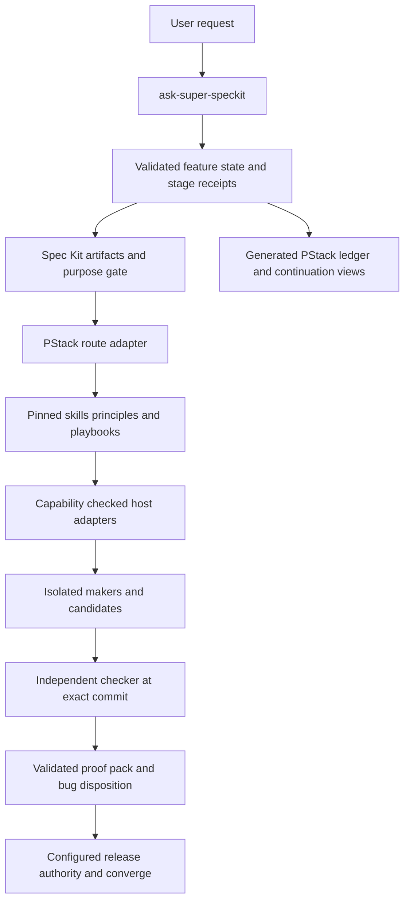

# Full PStack under the Super-SpecKit workflow

Date: 2026-10-06. Status: historical proposal; superseded by the approved implementation plan and docs/pstack-integration.md.

## Decision

Integrate the complete pinned PStack bundle as a subordinate engineering toolkit behind `ask-super-speckit`. Preserve Spec Kit's specification, plan, tasks, and convergence lifecycle and Super-SpecKit's purpose confirmation, Atlas, independent QA, immutable candidate evidence, and continuation contract. Use faithful adapters, with every intentional semantic difference declared. Use the selected **review, then selective comment edits** policy.

This supersedes the earlier recommendation in `pstack-comparison.md` to adopt only selected ideas. That earlier comparison remains historical. The five existing inspired commands are useful starting points; they are not a full PStack implementation.

“Full” means every upstream skill, principle, playbook, agent, script, and optional automation is inventoried and reachable through a documented route. It does not mean loading every instruction on every turn, enabling every external service, or claiming unavailable host capabilities work. Separate **bundle coverage**, **adapter coverage**, and **observed execution coverage**. A shipped file alone demonstrates only the first.

## Evidence and scope

Local checkout: `/Users/poom-work/super-speckit`, clean at the start, commit `ab8c571`. The handoff's longer repository path is historical; use this active checkout. Upstream checkout: `/tmp/pstack-source.ZdfSWm`, verified commit `e5a8186d7b43be8d6ac4452440fbead5f1a51c70`. The [pinned source](https://github.com/cursor/plugins/tree/e5a8186d7b43be8d6ac4452440fbead5f1a51c70/pstack) contains 51 top-level skills: 24 principles and 27 workflow skills, plus 23 playbooks, two agents, scripts/tests, docs/assets, and optional Benny automation. This inventory refers to that revision, not future `main`.

This proposal combines the handed-off source review, a fresh local contract audit, and the companion [upstream interface audit](pstack-upstream-interface-audit.md). Upstream source governs descriptions of upstream behavior; proposed paths, schemas, and policies below are design choices. No comparative productivity benefit has been measured.

## What needs correcting before orchestration expands

1. **Release validation is weaker than the documented contract.** `scripts/super_speckit.py` checks state membership and several fields/paths but has no allowed-transition graph, no proof-pack gate enforcement, no commit resolution, no clean-checker-worktree enforcement, and no open-bug release block. SHA validation accepts 7–64 hex characters without resolving a commit. Missing Atlas/Change Story paths become `repo / ''`, so the repository directory passes `exists()`.
2. **A negative fixture passed both transition and validation.** In a temporary non-Git directory, a record with an empty matrix, null Atlas/Change Story paths, an open bug, no QA run/proof pack, and synthetic `abcdef1` transitioned directly from `planned` to `ready_for_merge`. Both commands exited 0. This proves a CLI enforcement gap; it does not establish that a real agent has shipped an unsafe change.
3. **Merge authority contradicts itself.** Root `SKILL.md` says “Never merge automatically”; `docs/orchestration.md`, `docs/state-machine.md`, and config allow configured autonomous merge. Resolve this with one authority contract used by prose and executable checks. Integration itself grants no new merge permission.
4. **Routing is a prose list with unstable precedence.** `commands/ask-super-speckit.md` duplicates 14/15 numbering; maker/Ponytail and team conditions appear before continuation and candidate QA; confirmed defects appear after release. Persistent predicates without completion receipts could repeatedly select the same stage. Changing numbering is insufficient.
5. **Harness bootstrap is only bootstrap.** `harness-init` writes two Markdown templates. `record-artifact` checks existence and records a link. Neither executes smoke/cleanup nor validates a feature map. Keep the command, but distinguish `draft`, `usable`, and `stale` harness states.
6. **Existing `interrogate` is a different protocol.** It assigns different lenses/stances; upstream requires the same prompt and rubric across different models. Preserve lens review as an additional mode, and add faithful interrogation as its own mode. See [upstream interrogate](https://github.com/cursor/plugins/blob/e5a8186d7b43be8d6ac4452440fbead5f1a51c70/pstack/skills/interrogate/SKILL.md).
7. **Source-integrity claims need enforcement.** `sources.lock.json` says Ponytail was copied verbatim. Comparing pinned upstream bytes with the local file disproved that claim: upstream SHA-256 `1316a2f3f95741d2300b116fe0c2d81ce4a9568656ed0a62643f54aaf09957f2`; local `ebfc345363491484be7597a13bb4071bc322b721085a4c3b8c3133440bbbd20a`. Decide whether to restore exact bytes or describe an adaptation; do not silently rewrite it as part of this analysis.
8. **Current tests do not establish the advertised runtime contract.** All 23 local tests passed (`python3 -m unittest discover -s tests -q`). They include CLI fixtures and many presence/string checks; the synthetic SHA and empty matrix in successful state tests reinforce the gap. Passing this suite is a baseline, not full integration acceptance.

## Architecture



Keep upstream instructions unchanged in the vendor tree. Load an adapter contract together with a skill/playbook; the adapter defines host actions, native artifact outputs, and explicit overrides. Do not run raw sticky `poteto-mode` as another coordinator beside `ask`. Preserve its playbook selection and progressive principle loading through the route adapter. Record which upstream files were actually read; an inventory checkbox is not application evidence. [Mode](https://github.com/cursor/plugins/blob/e5a8186d7b43be8d6ac4452440fbead5f1a51c70/pstack/skills/poteto-mode/SKILL.md).

There should be one delivery authority, not one mutable state store per toolkit. Extend per-feature JSON and stage receipts; regenerate work-state YAML and PStack views. Git-shared continuation names the last accepted revision and next action; it must be validated against feature state and Git before resume. Treat transcripts as contextual evidence, never as a release receipt.

## Complete workflow-skill mapping

All 27 workflow skills are accounted for below. A route may be used for a bounded read-only question without creating a delivery feature; once product changes begin, the existing native gates apply.

| Stage or purpose | Upstream skills | Required adapter result |
| --- | --- | --- |
| Select and configure work | `poteto-mode`, `poteto-help`, `setup-pstack`, `figure-it-out`, `automate-me` | Task class, selected playbook, loaded principles, host capability receipt, role configuration. Custom workflows extend `ask`; no second default router. Novel playbooks declare gates and are evaluated before reuse. |
| Understand and explain | `how`, `why`, `teach`, `recall`, `blast-radius` | Evidence-linked Atlas cards, caller/boundary map, historical confidence, Change Story and runnable blast-radius claim. Recall uses current workspace and continuation before optional transcripts. |
| Design and compare | `architect`, `arena` | At least two structurally different designs where upstream requires them; caller-first API/types/modules, selection rubric, isolated candidate receipts, plan/task updates. Existing purpose gate remains upstream of edits. |
| Build and partition | `swarm`, `tdd`, `typescript-best-practices` | Race/partition declared before dispatch; disjoint ownership for partitions; isolated candidates for races; native feedback-loop receipt. Type guidance loads only for TypeScript work. |
| Establish and maintain proof | `create-verification-skill`, `maintain-verification-skill`, `benchmark-checklist` | Executable project verifier and feature map, live smoke/cleanup receipt, drift refresh, repeatable benchmark baseline and result with errors and relevant end-to-end measurement. |
| Review and improve structure | `interrogate`, `no-comments`, `correct` | Identical-rubric model panel, selective comment dispositions, structural enforcement demonstrated on historical bad example. Read-only reviewers return findings; makers apply accepted fixes. |
| Learn and explain decisions | `reflect`, `show-me-your-work` | Evaluated local improvement proposal, event-linked decision trail; upstream global-skill approval boundary remains explicit. No silent global or vendor rewrite. |
| Communicate | `technical-writing`, `unslop`, `bro` | Reviewable documentation and explanations appropriate to audience; no erasure of material risks, unknowns, evidence, or notices. |
| Optional service workflow | `make-bot-ui` | Explicitly enabled service adapter with checked webhook/bot/network/auth prerequisites and authorized external actions. Disabled by default. |

Each row has source implementations under the [pinned skills directory](https://github.com/cursor/plugins/tree/e5a8186d7b43be8d6ac4452440fbead5f1a51c70/pstack/skills). Details of host-sensitive interfaces are in the companion audit.

## Complete playbook mapping

| Native route | All upstream playbooks in that group | Integration behavior |
| --- | --- | --- |
| Research and diagnosis | `investigation`, `runtime-forensics`, `trace-forensics` | Read-only investigation or bounded instrumentation; distinguish observed symptom, hypothesis, cause, and demonstrated fix. Use existing diagnosis/reproduction artifact if a defect is confirmed. |
| Delivery | `feature`, `bug-fix`, `refactoring`, `prototype`, `visual-parity` | Feature follows spec/plan/tasks; bug follows reproduce/fix/retest; refactor proves protected behavior; prototype is disposable decision evidence, not release proof; visual parity adds controlled screenshot comparison plus behavioral QA. |
| Measurement | `perf-issue`, `hillclimb` | Baseline, hypothesis, controlled runs, accepted improvement per commit, stopping budget/target; independent verification on accepted candidate. |
| Planning and operations | `multi-phase-plan`, `autonomous-run`, `orchestrate` | Phase contracts, dependency frontier, pilot unit, rolling refill, completion drain and worker reconciliation. One coordinator does control-plane work while delegates own product edits. |
| PR and stack lifecycle | `opening-a-pr`, `babysit`, `shipping`, `autopilot-full`, `autopilot-stack` | Ordered commits, owner per PR, stack/base/head evidence, review/CI recovery, contiguous passing frontier. `autopilot-stack` prepares a reviewable stack; `autopilot-full` may merge only under configured authority. |
| Continuity and cleanup | `session-pickup`, `pause-safely`, `worktree-cleanup` | Shared continuation validation, cancellation/checkpoint receipt, evidence retention, worktree ownership and recoverable cleanup. Local paths must be remapped across hosts. |
| Toolkit development | `authoring-a-skill`, `eval` | Independent fixture evaluation of changed overlay/skill, blinded comparisons when claiming behavioral improvements, preserved upstream bytes. |

All 23 are retained. Source: [playbooks](https://github.com/cursor/plugins/tree/e5a8186d7b43be8d6ac4452440fbead5f1a51c70/pstack/skills/poteto-mode/playbooks).

## Complete principle mapping

Load applicable principles progressively rather than adding 24 universal preflight steps.

| Trigger | Principles | Native expression |
| --- | --- | --- |
| Scope and design | `attack-the-premise`, `foundational-thinking`, `redesign-from-first-principles`, `exhaust-the-design-space`, `experience-first` | Challenge solution assumptions in grill/architecture; preserve confirmed purpose or return material scope changes to purpose confirmation. Alternatives become plan/Change Story evidence. |
| Structure and ownership | `model-the-domain`, `boundary-discipline`, `type-system-discipline`, `migrate-callers-then-delete-legacy-apis`, `separate-before-serializing-shared-state` | Domain contracts, migration inventory, typed boundaries, partition ownership and dependency edges. |
| Minimality and durable learning | `laziness-protocol`, `subtract-before-you-add`, `build-the-lever`, `encode-lessons-in-structure`, `fix-root-causes` | Coordinate with Ponytail; simplify implementation while preserving requested capabilities and gates. Correct proves enforcement on a historical failure. |
| Proof and numbers | `prove-it-works`, `test-behavior-not-implementation`, `explain-the-number` | Public-seam feedback loop, independent runtime evidence, benchmark validity and uncertainty. |
| Long-running work | `outcome-oriented-execution`, `never-block-on-the-human`, `sequence-verifiable-units`, `make-operations-idempotent`, `guard-the-context-window`, `minimize-reader-load` | Safe autonomous technical choices, bounded units, idempotency keys, checkpoint receipts and progressive context. Required purpose/authority decisions still wait for actual authorization. |

These account for all 24 principle skills. The principle favoring autonomy cannot override the user's purpose gate, external-action authority, or unavailable credentials.

## Conflict resolutions and fidelity boundaries

**Planning:** Upstream favors code and can move from architecture directly to implementation. Preserve that engineering depth but materialize its result in native `plan.md`, `tasks.md`, matrix, and Change Story before maker dispatch. Do not add another independent plan authority. [Architect](https://github.com/cursor/plugins/blob/e5a8186d7b43be8d6ac4452440fbead5f1a51c70/pstack/skills/architect/SKILL.md).

**TDD:** Keep the existing native TDD/public-seam policy as the lifecycle contract. Use PStack TDD's compatible bug-first guidance inside it; do not maintain two independent completion flags or test policies. A deliberate difference is documented, not presented as verbatim execution.

**Models and independence:** `setup-pstack` becomes capability discovery plus project role config. Same prompt/rubric and candidate for `interrogate`; synthesize consensus, lone signals, disagreements and lead dispositions rather than majority voting. Same-model independent runs can be useful but are declared degraded, never called a diverse panel. If diversity is required and unavailable, block that requirement or record an authorized exception. Maker/checker independence is separately mandatory; model diversity alone does not establish it.

**Teams:** Preserve race/partition and selection decisions, isolated work, actual model identities, invalid-result retry limits, and aggregated coverage. Single owner for coupled code. OMP/Pi/Codex/Cursor adapters dispatch only with detected tools and allowed scope; cloud remains separately enabled. Rolling refill replaces batch waiting, but no dependency starts before its prerequisite result is accepted. [Swarm](https://github.com/cursor/plugins/blob/e5a8186d7b43be8d6ac4452440fbead5f1a51c70/pstack/skills/swarm/SKILL.md).

**State and scheduling:** Upstream orchestrate's Bun store records units/frontier/ledger/inbox; it does not launch or wake workers. Its frontier resolver also invokes Graphite even though shipping prose supports `gh`/Origin without it. Preserve these scripts unchanged for source fidelity, but route active bookkeeping through native state and a Git/gh/Origin frontier adapter. Generated upstream-format projections are read-only. Do not claim that copying the CLI creates a scheduler. [Orchestrate](https://github.com/cursor/plugins/blob/e5a8186d7b43be8d6ac4452440fbead5f1a51c70/pstack/skills/poteto-mode/playbooks/orchestrate.md).

**Proof reuse and shipping:** Preserve stack-frontier semantics but keep exact-candidate runtime QA. Patch-id equality can justify reuse of specified static/design evidence; it cannot silently pass runtime evidence on a new SHA. After a merge/rebase creates a new candidate, reassess and run required proof at that exact commit. Upstream shipping's more permissive reuse is a declared override. [Shipping](https://github.com/cursor/plugins/blob/e5a8186d7b43be8d6ac4452440fbead5f1a51c70/pstack/skills/poteto-mode/playbooks/shipping.md).

**Comments:** Comment Sicko reviews read-only. Each finding has a proposed encoding, disposition, and reason. Apply accepted edits in the maker tree; preserve rationale, Atlas references, license/legal notices, public contracts, and necessary suppressions unless an actual structural fix makes them unnecessary. This intentionally differs from upstream's aggressive deletion default. [No-comments](https://github.com/cursor/plugins/blob/e5a8186d7b43be8d6ac4452440fbead5f1a51c70/pstack/skills/no-comments/SKILL.md).

**Optional automation:** Bundle and document Benny and make-bot-ui without registering or running them by default. Detect prerequisites and preserve contact/publication authorization. A disabled optional pack does not block ordinary feature delivery. A task explicitly requiring it cannot be marked complete through an unrelated substitute.

## Proposed files and contracts

These are intended implementation changes, not files already created:

| Path | Change |
| --- | --- |
| `skills/upstream/pstack/` | Entire pinned source tree, including hidden plugin metadata, LICENSE, docs/assets, agents, scripts/tests and dormant automation. Never flatten relative paths. |
| `sources.lock.json` and `schemas/pstack-manifest.schema.json` | Source revision, complete per-file SHA-256 inventory, component type, dependency identifiers, license provenance, adapter route and coverage status. Bundle and adapter versions are separate. |
| `adapters/pstack/contract.md`, `routes.yml`, `dependencies.yml` | Explicit override precedence, 51/23 coverage map, invocation/outputs, required native stages and dependency alternatives. |
| `adapters/pstack/hosts/{codex,cursor,omp,pi}.md` | Dispatch, cancellation, model selection, transcript and runtime-control bindings. Documentation alone cannot mark these implemented. |
| `scripts/pstack_adapter.py` | Proposed narrow interface: `inventory`, `doctor`, `route`, `project`, `verify-source`. Reuse native state mutation and scheduler interfaces rather than a second store. |
| `scripts/super_speckit.py`, `schemas/` | Versioned feature, stage, worker, panel and proof schemas; explicit allowed transitions, bounded paths, full resolved commit IDs, QA identity/worktree checks, proof and bug gates, atomic updates and revision checks. |
| `commands/ask-super-speckit.md`, `skills/ask-super-speckit/` | Generated/documented routing precedence from tested predicates; stage completion and invalidation rules. |
| Existing harness/review/correct/decision/evaluate commands | Compatibility facades into adapters, with schema migration and old-interface documentation. Preserve existing callers. |
| `config/super-speckit.yml`, `SKILL.md`, orchestration/state docs | Single merge authority, model roles, capability/fallback policy, comment policy, optional service switches, upstream loading budget. |
| Project installer and mirrored installable content | Install the same pinned bundle/overlays idempotently; report drift, preserve project config/artifacts, require deliberate upgrades. |
| `tests/fixtures/pstack/`, behavioral adapter tests | Real and simulated host scenarios; negative release fixtures; source inventory completeness. |

Suggested config additions:

```yaml
pstack:
  source_revision: e5a8186d7b43be8d6ac4452440fbead5f1a51c70
  router: subordinate
  fidelity: faithful-with-declared-overrides
  comments: review-then-selective-edits
  model_roles: {} # populated from actual host discovery, not guessed identifiers
  diversity_when_unavailable: report-degraded
  optional_services:
    make_bot_ui: false
    benny: false
merge:
  mode: configured-authority # migrate existing flags; conflicting values fail validation
```

A capability receipt identifies host/tool versions, role model IDs, dispatch/isolation/cancel support, runtime surfaces, transcript scope, Git/PR transport, optional-service availability, checked time, and evidence. Each capability has `supported`, `degraded`, or `unavailable`, with a reason. Recheck when moving hosts or encountering capability drift. Do not embed credentials in receipts.

### State semantics

Add `schema_version`, monotonic `revision`, route/playbook revision, active candidate ID, stage receipts, worker attempts, and evidence references. A stage receipt binds stage ID, input revision, resolved candidate SHA where applicable, artifact digests, outcome, adapter version, and next-action reason. Its idempotency key combines feature, stage, input revision and attempt. An old receipt remains history but cannot pass changed inputs.

Candidate records are immutable: a fix creates a new candidate and QA run instead of replacing the identity of old proof. Store complete commit IDs resolved by Git; do not hard-code only SHA-1 length. An acceptance receipt binds matrix revision/coverage, environment, commands/exit statuses/logs, sanitized runtime artifacts, checker identity, clean worktree/base, bugs and required manual journeys. Reject placeholders, out-of-root paths, directories where files are required, stale evidence, and conflicting status fields.

Use one coordinator writer with compare-and-swap revisions and a lease token for local scheduling. Across Git-shared hosts, continuation names the last committed accepted revision; concurrent writers cause reconciliation, not last-write-wins. A lease file on one machine alone cannot enforce a cross-host lock. Workers return attempt-bound event receipts; the coordinator validates and drains them before updating authority. Record abandoned/retried attempts, cancel zombies and reject late duplicate completions.

### Deterministic next-stage selection

Before ordinary routing: validate state/Git; reconcile continuation, active attempts and host capabilities. Then prioritize confirmed defects/red evidence, unresolved required purpose decisions, missing native prerequisites, harness/feedback/phase readiness, dependency-ready maker units, candidate environment/QA, required static/manual review, release, reassessment/converge. Learning and pause receipts are event-triggered side stages, not unconditional routes that starve delivery.

Each predicate has a completion receipt and invalidation inputs. For example, Ponytail runs once per bounded maker unit and input revision; it cannot keep preempting QA after a candidate exists. Continue resumes a recorded task, then clears the resume event; its existence is not an endless stage condition. Ready-for-merge is an executable decision after evidence validation, not a stored claim accepted at face value.

## Host and dependency policy

| Dependency | Default treatment | Required proof before claiming support |
| --- | --- | --- |
| Cursor Task/background/cloud, AskQuestion, todo, sticky mode, `/loop` | Translate to configured host controls; unavailable controls are explicit | Dispatch/wait/cancel round trip; bounded concurrency; event wake/resume behavior; real tool and model identities |
| `cursor-team-kit` deslop/control-cli/control-ui | Separate pinned dependency or documented semantic adapter | Correct runtime control and capture on the relevant platform; do not invent a same-named local skill |
| Bun/Commander and upstream script bootstrap | Retain source; install frozen dependencies outside immutable vendor bytes | Lockfile integrity, clean install, documented first-use install side effects; source hashes remain unchanged after execution |
| GitHub/`gh`, Origin, Graphite | Select configured transport; `watch-pr` requires GitHub; raw `orch frontier` requires Graphite | Empty/unknown checks fail closed; frontier order verified against actual base/head; separate readiness from merged state |
| Cursor transcripts and external rationale sources | Use only available, authorized active-workspace sources | Scope and provenance recorded; inaccessible history yields unknowns rather than invented rationale |
| Grok bot/webhook/Tailscale and Benny | Bundle but disable until explicitly configured | Service/auth/dispatch checks and authorized contact actions; no secrets in artifacts |
| Cleanup and macOS helpers | Portable ownership-aware adapter; retain original as upstream-specific | Paths with spaces, platform differences, dirty/unpushed branches, preserved evidence and recoverable snapshot |

Support for four hosts is a target, not a current certification. Start with the host actually exercised by the project; add each other host only after its adapter tests run. Do not design a fictitious common API from guessed commands. Discovery identifies callable capabilities; the adapter binds them to this contract.

## Migration and delivery order

1. **Freeze and inventory.** Vendor the complete pinned bundle and MIT notices; enumerate hidden files and every component/dependency; add hash/inventory checks and declared fidelity overrides. No active routing changes yet. Confirm no missing 51st skill or 23rd playbook.
2. **Repair the authority foundation.** Version state schemas; enforce transitions, commit/worktree identity, proof coverage and bug gates; reconcile merge policy; add atomic revisioned mutations and deterministic routing with completed-stage receipts. Migrate existing feature/continuation records without discarding historical evidence. Mark legacy claims requiring revalidation as such, rather than upgrading them to pass.
3. **Integrate the vertical feature and bug paths.** Route understanding/architecture/principles, native feedback loop, isolated maker, executable verification generator, faithful panel, selective comments, independent QA and release. Keep the old commands as facades. Acceptance requires running these paths, not just passing manifest tests.
4. **Integrate concurrency and operations.** Add arena/swarm dispatch, pilot/rolling-refill scheduler, failed-worker recovery, ledger projections, stack frontier, PR watching and exact-SHA shipping. Preserve cloud opt-in and one owner for shared mutable work. Exercise local-to-Pi continuation without duplicate edits.
5. **Complete specialist routes.** Performance/hillclimb, runtime/trace forensics, visual parity, prototypes, skill authoring/eval, reflect/automate-me, cleanup, teaching and help. Optional bot/Benny routes remain truthfully disabled until exercised with prerequisites.
6. **Certify and document.** Independently forward-test adapters and the main entry point in isolated fixtures. Publish capability coverage and limitations per host, update installable mirrors and migration docs, then demonstrate an ordinary user's request completing through `ask` without a second coordinator.

Each phase is reviewable and independently validated, but the overall promise remains full integration. The phased plan does not redefine completion as the five existing approximations. Upstream updates use a reviewed pin bump, source diff, manifest regeneration and targeted adapter regression tests; do not auto-track `main`.

## Behavioral acceptance plan

| Scenario | Observable acceptance condition |
| --- | --- |
| Full inventory and source integrity | Enumerated skills/playbooks/agents/scripts/automation match pinned tree; missing, extra or modified vendor bytes fail. Optional dependency inventory is complete. |
| Feature end to end | One `ask` request produces native artifacts, purpose receipt, understanding/design, maker candidate, executable verifier, distinct clean checker and exact-SHA proof; converge records outcome. |
| Bug end to end | Preserved repro fails before fix; root cause and regression coverage recorded; independent retest passes on new candidate. |
| Missing purpose or native prerequisite | Maker dispatch is rejected; agents cannot supply human confirmation. A confirmed existing purpose is not needlessly re-asked. |
| False release fixture | Synthetic/unresolved SHA, null/empty paths, empty matrix, missing proof, open bug or failed gate blocks `ready_for_merge` and merge. Include direct record tampering, not only happy-path CLI use. |
| Candidate drift | New SHA or matrix revision invalidates affected acceptance; patch-id equality cannot satisfy exact-SHA runtime requirements. |
| Faithful panel | Models receive byte-identical prompt/rubric/input SHA; receipts identify actual models; dissent survives synthesis; findings cannot close runtime rows. |
| Unavailable model/dispatch/runtime | Capability status names limitation; no fabricated agent or family; required unavailable role cannot pass. Optional degraded modes retain explicit labeling. |
| Maker/checker isolation | Checker cannot alter product files; dirty/shared checkout is rejected; maker proof cannot self-certify QA. |
| Race and partition | Race candidates isolated; partition write sets/dependencies checked; selection reason and rejected results retained; coupled work has one owner. |
| Rolling refill and recovery | Ready replacement starts after a result is drained; failed worker receives a bounded new attempt; zombies canceled; duplicate/late completion cannot advance state. |
| Concurrent state writers | Stale revision/lease rejected, interrupted mutation leaves valid state, multi-host conflicts require reconciliation. |
| Resume across hosts | Shared continuation verified after pull, paths remapped, actual capabilities rediscovered; valid proof preserved; completed route does not execute twice. |
| Selective comment review | Redundant comment removed or encoded; rationale/Atlas/legal/public-contract fixtures preserved; reviewer remains read-only. |
| Generated verifier | Actual test app is launched, readiness checked, behavior driven, API/DB persistence asserted where required, intentional broken behavior caught, cleanup recorded. Templates cannot count as usable. |
| PR/watch/ledger semantics | Failed ledger row with exit 0 remains failure; status-only exit 0 remains observation; empty check set remains unknown; raw Graphite absence handled explicitly. |
| Stack shipping | Only contiguous independently verified frontier can land under configured authority; upstream/base drift triggers recheck; readiness never presented as merged. |
| Historical correction | Real captured bad case fails the new structural check, good case passes, isolated evaluator reports observed behavior. |
| Performance claim | Baseline/changed workloads comparable; repeats, errors, limiter and end-to-end relevance recorded; unexplained numbers rejected. |
| Disabled optional services | Ordinary delivery works without bot/Benny; explicitly requested service task remains blocked until prerequisites/authority exist. |
| Idempotent install/upgrade | Reinstall preserves config/artifacts, does not duplicate routes, detects vendor drift and produces a migration report. |
| Cleanup | Unpushed/dirty/owned worktree retained or recoverably snapshotted; paths with spaces and host differences handled; QA evidence retained. |

Use real temporary Git repositories and a small running fixture app for authority, verifier and candidate tests. Fake host adapters test fault/retry/idempotency behavior; they do not establish live provider support. Add a live adapter smoke test per claimed host and a controlled GitHub integration fixture for watcher claims. Keep static source checks for inventory and notices, not as substitutes for execution tests.

## Costs, tradeoffs, and completion criteria

The valuable addition is complete engineering and operations coverage: deeper caller-first design, actual model comparison, performance/forensics, reusable runtime verification, mature PR/stack handling, and structural learning. The cost is adapter upkeep across host APIs, more orchestration state, and potentially expensive model/QA runs. Progressive loading, bounded teams, one owner for coupled code, one native TDD contract, and generated projections contain that cost.

The highest implementation risk is expanding dispatch before repairing acceptance. The highest fidelity risk is renaming persona reviews or Markdown templates as their upstream equivalents. The highest operational risk is confusing observations, existing ledger rows, and passing release evidence. The proposed order addresses those directly.

Integration is complete only when the manifest accounts for the whole pinned bundle, every capability has a route and declared dependency/override, core feature/bug flows and negative gates pass behavioral evaluation, existing interfaces migrate, and per-host coverage reports match actual execution. Optional externally dependent routes may be distributed as unavailable/disabled, but their status must remain visible. Claims such as “full upstream behavior works on every host” require live certification of those hosts and services.

## Work completed in this analysis

Created this proposal and the companion audit only. No implementation, global skill edits, vendoring, merge-policy change, commit, or push was performed. Local baseline: 23 tests passed. Upstream temporary checkout: 52 tests / 206 assertions passed; watcher typecheck passed, with orchestration excluded by its typecheck configuration. The negative native-state fixture and Ponytail hash comparison established concrete audit findings. Upstream tests do not prove this proposed integration, cloud dispatch, live runtime QA, or merge behavior.
